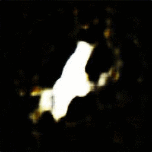
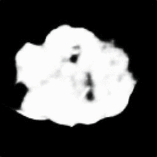

# Segmentation of Skin Lesions and their Attributes using Generative Adversarial Networks (Pix2pix)

This work is about the semantic segmentation of skin lesion boundary and their attributes using Image-to-Image Translation with Conditional Adversarial Nets. Melanoma is a type of skin cancer that can be cured if detected in time and the process of segmentation into dermoscopic images is an essential procedure for computer-assisted diagnosis due to its existing artifacts typical of skin images. To alleviate the image annotation process, we propose to use a modificated Pix2Pix network. The discriminator network learns the mapping from a dermal image as an input and a mask image of six channels as an output. Likewise, the output of the discriminative network called PatchGAN is varied for one channel and six output channels. The images used come from the 2018 ISIC Challenge where 500 images are used with their respective semantic map, divided into 75% for training and 35% for testing. Obtaining for 100 training epochs high jaccard indices for all attributes of the segmentation map.

## Se realiza dos pruebas:
### Ejemplo dataset para detección de atributos:
<ul>
  <li>pigment network</li>
  <li>negative network</li>
  <li>streaks</li>
  <li>milia-like cysts</li>
  <li> globules (including dots)</li>
</ul>

### Ejemplo dataset para segmentacion de lesion: 

## Getting started

### Descargar el dataset

Necesitamos descargar estos archivos del concurso [2018 ISIC Challenge](https://challenge2018.isic-archive.com/participate/) de la parte de training. Guardar las 3 carpetas en una carpeta "dataset"

<ul>
  <li>ISIC2018_Task1-2_Training_Input</li>
  <li>ISIC2018_Task1_Training_GroundTruth</li>
  <li>ISIC2018_Task2_Training_GroundTruth_v3</li>
</ul>

### Configuring the enviroment.
Para preparar todo seguir los pasos:

Yo uso conda enviroments:

`conda env create -f environment.yml`

### Make dataset

Run Make_dataset.ipynb , cambiar TARGET = 'MAP' or 'SEGMENTATION' dependiendo de la prueba que desees.
  
Run Train_Test_pix2pix.ipynb , cambiar TARGET = 'MAP' or 'SEGMENTATION' dependiendo de la prueba que desees.

## Resultados

### Ejemplo dataset para detección de atributos:
Para 50 epocas  para la imagen ISIC_0013664.jpg: 
####  Entrada_____________________________Original_____________________________Pix2pix
   

### Ejemplo dataset para segmentacion de lesion:
Para 50 epocas  para la imagen ISIC_0000264.jpg: 
####  Entrada_____________________________Original_____________________________Pix2pix
   

# Referencias

Se toma como referencias:

[paper](https://arxiv.org/abs/1611.07004) "Image-to-Image Translation with Conditional Adversarial Networks" El paper explica el trabajo de la red Pix2pix.

[paper](https://arxiv.org/abs/1902.03253) "Skin Lesion Synthesis with Generative Adversarial Networks" in ISIC Skin Image Analysis Workshop and Challenge @ MICCAI 2018. Donde utilizan el dataset de 2018 ISIC Challenge teniendo como entrada una mascara semantica y como salida una imagen de una lesion cutanea. Disponible [here](https://github.com/alceubissoto/gan-skin-lesion).

[paper](https://arxiv.org/abs/1907.00856) "MobileGAN: Skin Lesion Segmentation Using a Lightweight Generative Adversarial Network". Se toma comom referencia la metodología.

[paper](https://arxiv.org/pdf/1904.11126.pdf) "Skin Cancer Segmentation and Classification with NABLA-N and Inception Recurrent Residual Convolutional Networks". Se toma como referencia la importancia de la segmentación y de eliminar los artifacts.

